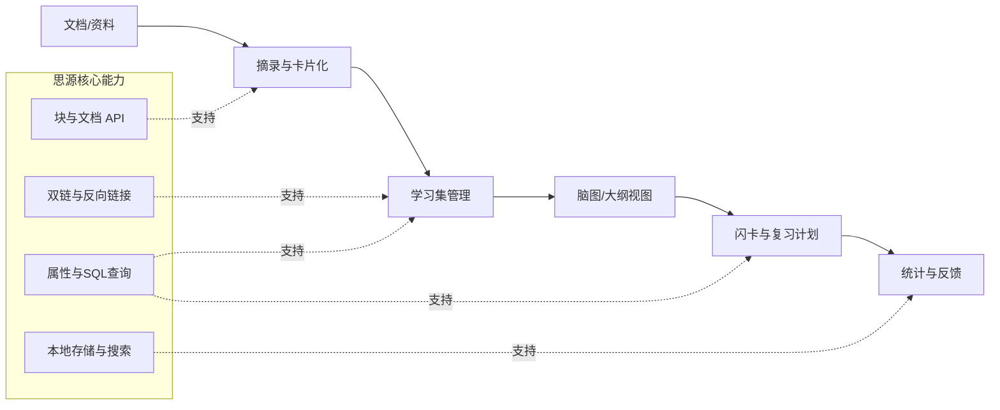

下面我先给一个整体结论，然后直接给你一份可以当作「需求文档 + 功能清单 + 技术边界说明」的草案，你可以按这个去和开发者沟通或在 GitHub 上立项。
---
## 一、整体定位 & 结论
- MarginNote 4 的核心是：  
  「文档阅读（PDF/ePub）+ 摘录卡片 + 学习集（主题式知识库）+ 脑图/大纲 + 闪卡/复习 + AI 助学」的一体化学习工具。
- 思源笔记本身已经是「本地优先 + 双链 + 块级存储」的知识管理工具，有完整的 RESTful API 和块级操作能力。
- 你的目标：**做一个“MarginNote 风格”的思源插件**，而不是重新实现 MarginNote 全部功能。建议聚焦在：
  1. 在思源里实现「卡片摘录 + 学习集 + 脑图/大纲 + 闪卡复习」的闭环；
  2. 充分利用思源的双链、块属性、SQL 查询等能力，避免做重复造轮子的「本地存储」。
  下面这份文档可以直接当作产品需求文档（PRD）使用。
---
## 二、项目概述
### 1. 项目背景
MarginNote 4 在 Mac/iOS 上通过「文档 → 摘录卡片 → 学习集脑图 → 闪卡复习」形成完整学习闭环，适合深度阅读与考试复习场景。  
思源笔记具备：
- 本地优先、开源、隐私优先的知识管理基础；
- 强大的块级 API、笔记本/文档管理 API、SQL 查询和属性系统；
- 插件生态（插件、挂件、主题等）。
因此，在思源上开发一个「MarginNote 风格学习插件」是可行且有价值的目标。
### 2. 产品定位
- 一句话定位：  
  **在思源笔记中实现 MarginNote 风格的“阅读 → 摘录 → 脑图构建 → 间隔复习”学习闭环插件。**
- 核心差异点：
  - 不强依赖 PDF/ePub 阅读器内核，而是借助思源自身文档和双链；
  - 学习集、卡片、脑图、闪卡等对象都映射为「思源块/文档」，天然支持跨文档引用、反向链接、SQL 查询；
  - 插件形态为主（不重做本地存储），便于维护和升级。
---
## 三、目标用户 & 使用场景
### 1. 目标用户
- 高校学生：考试复习、课程笔记、论文精读；
- 考证/考研人群：需要按「主题/科目」构建知识体系并反复复习；
- 研究人员/工程师：阅读文献、技术文档，需要做知识拆解和长期记忆。
### 2. 典型使用场景
1. **主题阅读 / 文献研读**
   - 用户将多篇 PDF/网页/Markdown 文档归档到一个「学习集」；
   - 在阅读过程中摘录重点，自动生成卡片；
   - 在脑图中重新组织卡片，形成知识框架；
   - 通过闪卡/复习模块进行长期记忆。
2. **考试复习**
   - 按「科目/章节」创建学习集；
   - 使用摘录工具将错题、知识点快速转为卡片；
   - 在脑图中梳理知识结构，通过闪卡模式进行自测。
3. **知识管理**
   - 将工作中积累的技术文档、规范、笔记统一放入学习集；
   - 通过卡片盒看板和标签进行分类和检索。
---
## 四、整体功能架构（Mermaid 总体图）

---
## 五、核心功能模块详细需求
### 模块 1：学习集（Study Set）管理
**目标**：类似 MarginNote 的「学习集」概念，用来按主题聚合文档、卡片、脑图和复习计划。
#### 1.1 学习集结构
- 每个学习集对应一个思源文档（或笔记本），文档元数据存储：
  - 标题、描述、封面图；
  - 关联资料列表（文档 ID/外部链接）；
  - 复习设置（算法参数、每日新卡数量等）。
- 在学习集文档中提供：
  - 概览视图：卡片统计、复习进度、最近学习时间；
  - 快捷入口：进入脑图、卡片盒、闪卡复习。
#### 1.2 学习集操作
- 创建学习集：向导式创建，支持选择已有笔记本/文件夹或新建；
- 编辑学习集：修改名称、描述、关联资料；
- 删除学习集：保留底层文档和卡片，只删除学习集元数据（软删除）；
- 学习集列表：在插件 Dock/侧边栏展示，支持搜索、排序。
---
### 模块 2：摘录与卡片系统
**目标**：将阅读过程中的内容快速转为可复用的知识卡片，类似 MarginNote 的摘录与卡片机制。
#### 2.1 摘录来源
优先支持：
- 思源文档内的选中文本（块内文本）；
- 思源代码块、公式块；
- 图片（本地图片或网络图片）；
- 外部网页/Markdown 文本（通过剪藏或粘贴）。
#### 2.2 卡片数据结构
每张卡片映射为一个「思源块」，通过块属性存储：
- `type`: card / excerpt / flashcard 等；
- `source_id`: 来源文档/块 ID；
- `source_location`: 页码/章节/锚点（如果是从 PDF 来，可先简单记录文本片段）；
- `tags`: 标签列表；
- `status`: new / learning / review / suspended；
- `created_at`, `updated_at`；
- `difficulty`: 用户对卡片的难度评分。
#### 2.3 摘录交互
- 在思源编辑器中选中文本 → 右键菜单或快捷键 → 「摘录为卡片」；
- 弹出卡片编辑浮层：
  - 可编辑标题、内容；
  - 选择目标学习集；
  - 添加标签；
  - 可选：立即生成闪卡（正面/反面）。
- 摘录完成后：
  - 在原文位置保留「卡片标记」（如高亮 + 小图标）；
  - 点击标记可跳转到对应卡片块。
---
### 模块 3：脑图 / 大纲视图
**目标**：在学习集中以思维导图/大纲形式组织卡片，形成知识框架。
#### 3.1 脑图数据存储
- 每个学习集可有一个或多个脑图；
- 脑图节点对应卡片块或其他块，通过块属性存储：
  - `layout_x`, `layout_y` 坐标；
  - `collapsed` 是否折叠；
  - `parent_id` 父节点 ID；
- 脑图本身是一个「容器块」，包含所有节点的引用。
#### 3.2 脑图交互
- 基本操作：
  - 添加/删除/重命名节点；
  - 拖拽改变层级和顺序；
  - 折叠/展开分支；
  - 缩放、平移画布。
- 节点内容：
  - 支持显示卡片标题、摘要；
  - 双击节点打开对应卡片块编辑；
  - 支持嵌入简单 Markdown（加粗、链接、公式）。
- 布局：
  - 支持多种布局：思维导图、树状图、鱼骨图、时间轴等；
  - 可参考 MarkMind 支持的结构。
#### 3.3 与思源双链的整合
- 节点可以引用任意思源块，实现：
  - 一个节点对应多张卡片；
  - 不同脑图引用同一张卡片（通过块 ID）。
- 利用思源反向链接：
  - 在卡片块中可以看到该卡片出现在哪些脑图中。
---
### 模块 4：卡片盒看板（Card Box）
**目标**：类似 MarginNote 的卡片盒看板，对卡片进行分组、过滤、排序。
#### 4.1 看板视图
- 按学习集显示所有卡片；
- 支持字段：
  - 标题、来源、标签、状态、难度、最后复习时间、下次复习时间；
- 支持视图：
  - 看板视图（按标签或状态分列）；
  - 列表视图；
  - 时间线视图（按创建时间/复习时间）。
#### 4.2 筛选与排序
- 按标签、来源文档、状态筛选；
- 按下次复习时间、难度排序；
- 支持保存常用筛选条件为「智能学习集」。
---
### 模块 5：闪卡与间隔复习（SRS）
**目标**：实现类似 MarginNote 的闪卡复习和遗忘曲线算法。
#### 5.1 闪卡数据模型
- 每张闪卡对应一个块，包含：
  - 正面内容（Markdown）；
  - 反面内容；
  - 关联的卡片 ID 或来源块 ID；
  - 算法参数：
    - `ease_factor`：难度因子；
    - `interval`：当前间隔天数；
    - `repetitions`：连续正确次数；
    - `next_review`：下次复习日期。
#### 5.2 复习流程
- 进入复习模式：
  - 按学习集或标签选择要复习的闪卡；
  - 使用类似 Anki/MarginNote 的复习流程：
    - 显示正面 → 用户回忆 → 显示反面 → 自评（Again / Hard / Good / Easy）；
    - 根据评分更新间隔和下次复习时间。
- 支持算法：
  - 初期可使用简化 SM-2 或 FSRS（MarginNote 4 已采用 FSRS），后期可扩展为插件化算法模块。
#### 5.3 复习统计
- 每日复习卡片数、正确率；
- 预计复习日历；
- 学习集维度的统计图表。
---
### 模块 6：AI 能力集成（可选但建议）
参考 MarginNote 4 的 AI 功能（AI 词典、拆书、对话等）：
1. **AI 卡片整理**
   - 自动为摘录卡片生成摘要、标题；
   - 根据卡片内容自动打标签。
2. **AI 辅助出题**
   - 根据卡片内容生成闪卡的正反面；
   - 生成填空题、选择题。
3. **AI 对话**
   - 在学习集中对当前卡片/脑图进行提问；
   - 调用外部大模型（需用户提供 API Key 或后端）。
---
### 模块 7：外部资料挂载（PDF/ePub）
**目标**：类似 MarginNote 的「外部文档库」功能。
#### 7.1 挂载本地 PDF
- 用户指定本地目录，插件将目录下的 PDF 挂载到学习集；
- 使用思源资源上传 API 将 PDF 存入 `/assets/`；
- 每本 PDF 对应一个索引文档，记录：
  - 文件路径；
  - 总页数；
  - 当前阅读位置；
  - 关联的卡片列表。
#### 7.2 PDF 阅读与摘录
- 初期可简单：
  - 使用思源内置 PDF 预览；
  - 通过文本选择 + 右键菜单触发摘录；
- 长期：
  - 内嵌 PDF.js，实现更精细的标注和留白功能（类似 MarginNote 的「书本留白」），但这是大工程，建议分期。
---
### 模块 8：搜索与导航
#### 8.1 全局搜索
- 支持在插件内搜索：
  - 卡片标题/内容；
  - 学习集名称；
  - 标签。
#### 8.2 跳转与回源
- 从卡片跳转到：
  - 原始文档位置（若已记录块 ID）；
  - 脑图中的节点位置；
- 类似 MarginNote 的「场景回源」：记录摘录时的位置、时间、脑图引用。
---
## 六、非功能需求
### 1. 性能要求
- 脑图节点数：支持至少 500 节点流畅拖拽、缩放；
- 卡片数量：单学习集支持 2000+ 卡片，列表/看板滚动流畅；
- 复习队列：初始加载时间 < 1s（本地缓存）。
### 2. 兼容性
- 支持思源桌面版（Windows / macOS / Linux）；
- 若后续支持 Web 版，需考虑前端渲染性能；
- 遵循思源插件规范（plugin.json、目录结构等）。
### 3. 可维护性
- 插件代码结构：
  - `src/`
    - `studyset/`：学习集相关逻辑；
    - `card/`：卡片与摘录；
    - `mindmap/`：脑图/大纲；
    - `review/`：复习与闪卡；
    - `ai/`：AI 相关；
    - `pdf/`：PDF 挂载与阅读；
  - `index.ts`：插件入口，注册命令、面板等。
- 使用 TypeScript，尽量复用思源已暴露的类型定义。
### 4. 安全与隐私
- 本地优先：所有数据默认保存在思源工作空间，可离线使用；
- 若集成 AI，需明确提示数据发送到第三方服务，并提供开关；
- 不上传用户笔记内容到开发者服务器（除非用户明确授权）。
---
## 七、实现路径建议（分期）
### 第 0 期：基础框架
- 搭建思源插件工程结构；
- 实现：
  - 学习集文档的创建/编辑/删除；
  - 简单的卡片摘录（选中文本 → 创建卡片块）；
  - 卡片列表视图。
### 第 1 期：脑图 + 卡片盒
- 实现脑图编辑器（基于 Canvas 或 SVG）；
- 将脑图节点与卡片块关联；
- 实现卡片盒看板与筛选。
### 第 2 期：闪卡与复习
- 实现闪卡数据模型和复习流程；
- 集成基础 SM-2 或 FSRS 算法；
- 提供复习日历和统计。
### 第 3 期：外部资料 + AI
- 实现本地 PDF 挂载与基础摘录；
- 接入 AI 能力（可选，根据需要）。
---
## 八、与现有思源插件的关系 & 注意点
- 已有 `siyuan-markmind` 插件提供思维导图功能。你可以：
  - 直接复用其脑图渲染引擎（如果合适）；
  - 或自建更轻量的导图视图，重点围绕「学习集 + 卡片 + 复习」。
- 注意思源 API 仍在演进，某些 PDF 关联跳转等功能需要等待 API 完善。
- 所有数据尽量用「思源块 + 属性」存储，避免维护额外的 JSON 文件，这样能天然享受双链、SQL 查询等能力。
---
如果你愿意，我可以在下一步帮你把这份文档整理成「GitHub Issue 模板」或「Milestone + Task List」的形式，方便你直接用做开发计划。